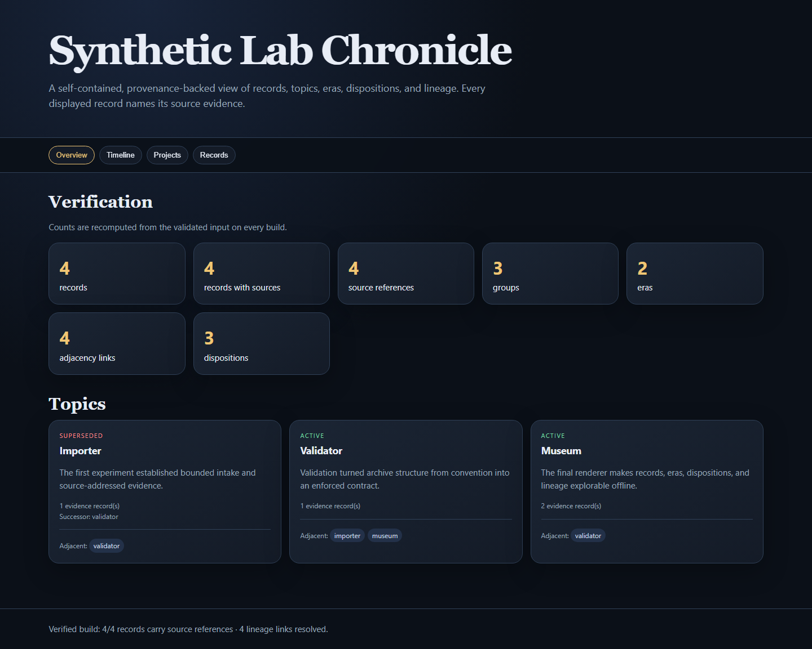

# Evidence Archive Museum

Build a portable, searchable exhibit from a structured archive. A small set of JSON/JSONL files becomes one self-contained HTML page with record, group and era navigation.



## Try it

Python 3.11 or newer.

```sh
python -m pip install -e .
python -m evidence_archive_museum.cli validate examples/synthetic_archive
python -m evidence_archive_museum.cli build examples/synthetic_archive --output demo-museum.html
```

Open `demo-museum.html` locally, or inspect the included [example exhibit](example-site/index.html). The [synthetic archive](examples/synthetic_archive/records.jsonl) has four records, three groups, two eras and four source references. Edit a copy of the input and rebuild to see how its relationships change. Existing output is protected unless `--force` is passed.

## How it works

A small archive can carry its own navigable presentation without a service or database. Read the [mechanism and implementation notes](docs/MECHANISM.md) for the specific boundaries and source links.

## Scope

Validation establishes internal structure, not truth of the records. Source-path fields are labels rather than links that the tool fetches. Treat archive inputs as the deliberate public selection: the renderer cannot decide which source material you are authorized to share.

## Verify

`python -m pytest` runs the behavior tests (install `pytest` first). The runnable example above provides a separate first-use check.

MIT licensed; see [LICENSE.md](LICENSE.md). Origin and release boundaries are documented in [ORIGIN.md](ORIGIN.md) and [SECURITY.md](SECURITY.md).
## Inspect the example result

Open the [saved synthetic result](example-site/index.html) alongside its [input and demonstration](examples/synthetic_archive/records.jsonl). The result is from the bundled synthetic example; local machine paths and temporary run identifiers are excluded from public projections.
